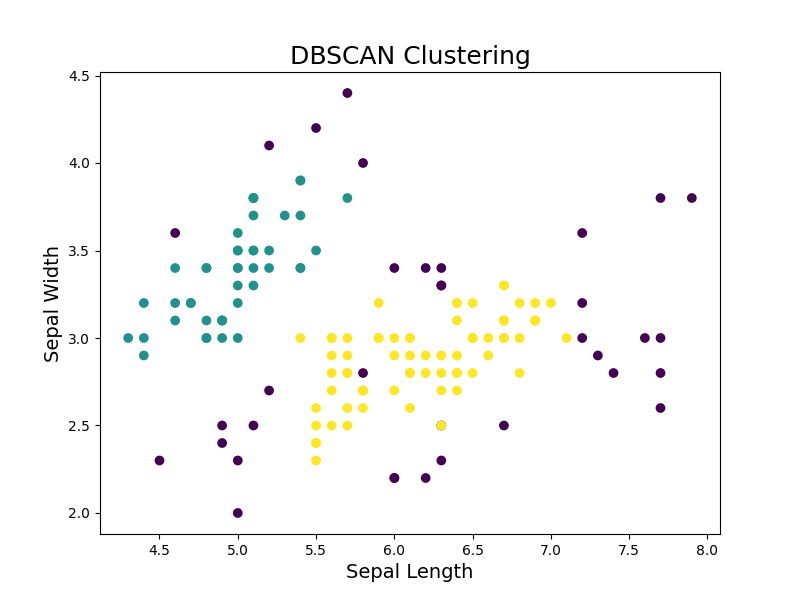

# PyProject
Implemented the IRIS data set from kaggle.com ----> https://www.kaggle.com/datasets/arshid/iris-flower-dataset/data

Included the csv file her in the project directory as well

used this code ---> https://www.kaggle.com/code/endofnight17j03/baggingcassification-essemble/notebook for bagging

used this code ---> https://www.kaggle.com/code/arosekp/iris-dataset-analysis/edit for DBScan clustering

DBSCAN cluster that shows the degrees of similar and cluster of datapoint (on the basis of sepal width and sepal length - shows the hotpoints)